# v0.6.0

## :sparkles: New Features

### 1. Outline collapse and position

The outline support collapse and setting position with the "vscode-md.options.outline.position"

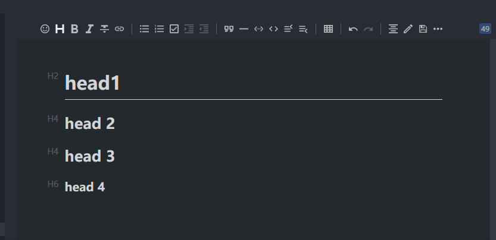

### 2. I18n: 繁體中文 & ru_RU

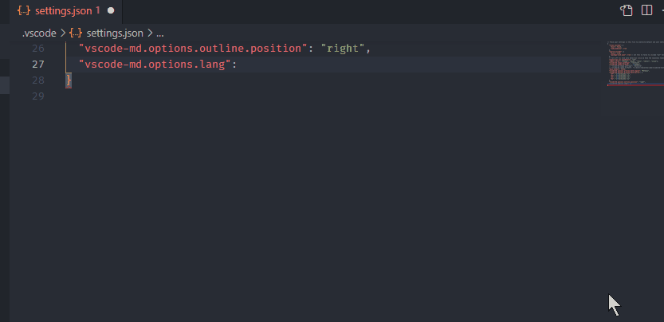

### 3. Better editor layout

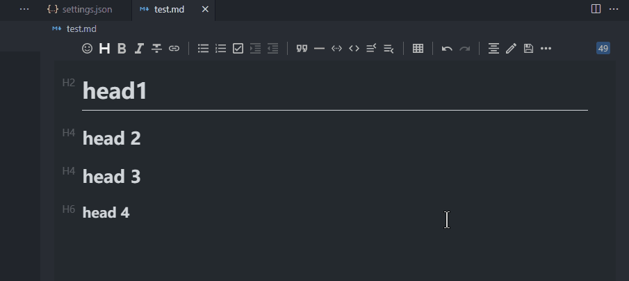

### 4. Support PlantUml

# v0.5.0

## :sparkles: New Features

### 1. Support flowchart

### 2. New math formula rendering engine: MathJax

- config settings：

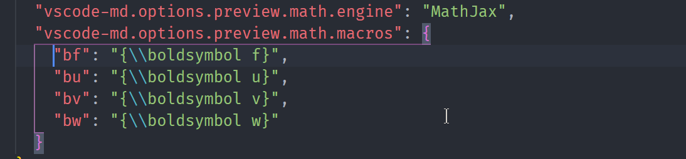

- write math formula:

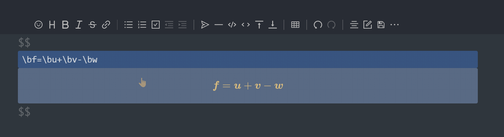

# v0.4.0

### ✨ New Features

#### 1. Path autocomplete

#### 2. Support YAML Front Matter syntax

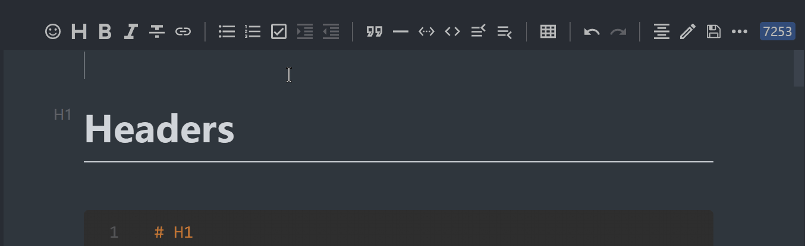

#### 3. Support mark syntax

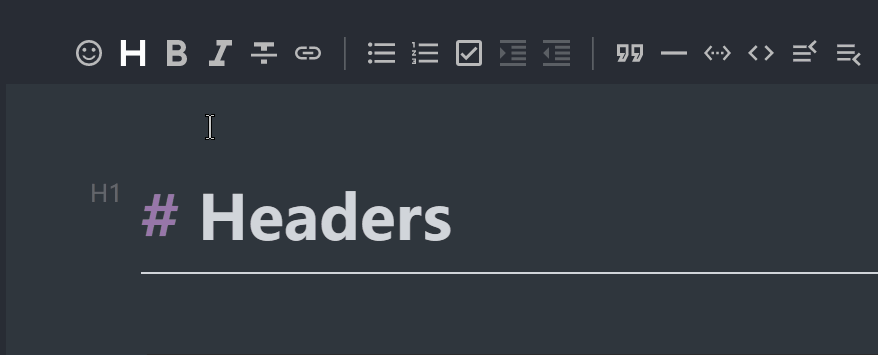

set `options.preview.markdown.mark=true`, to enable it.

#### 4. Localization: Japanese

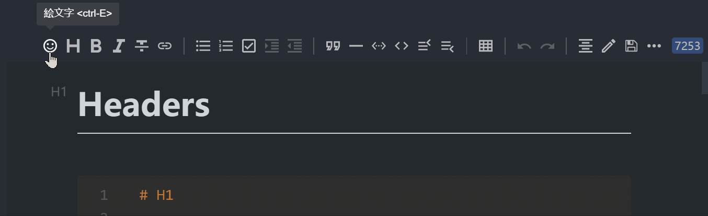

#### 5. New theme: Ant Design

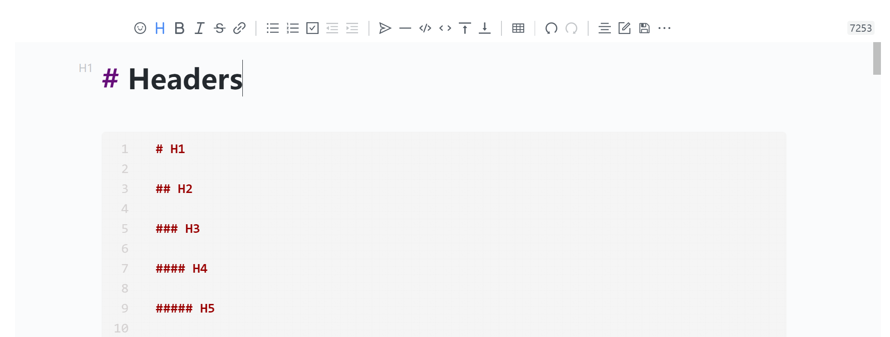

# v0.3.0

## ✨New Features

#### improve 'sv' mode

before:

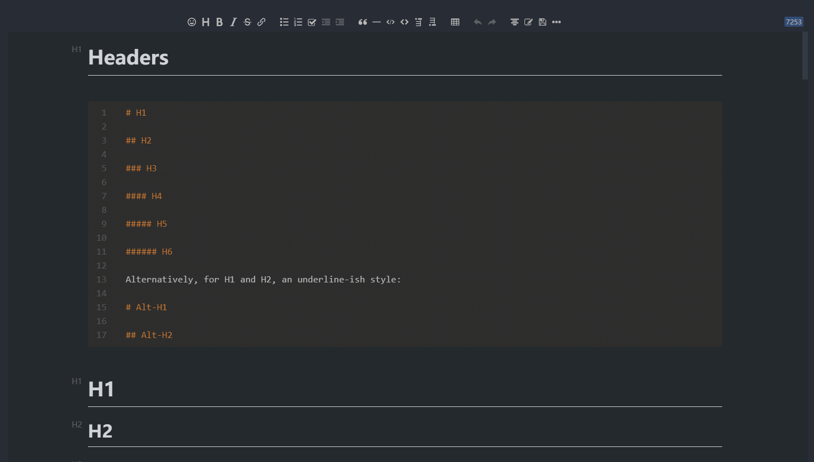

after:

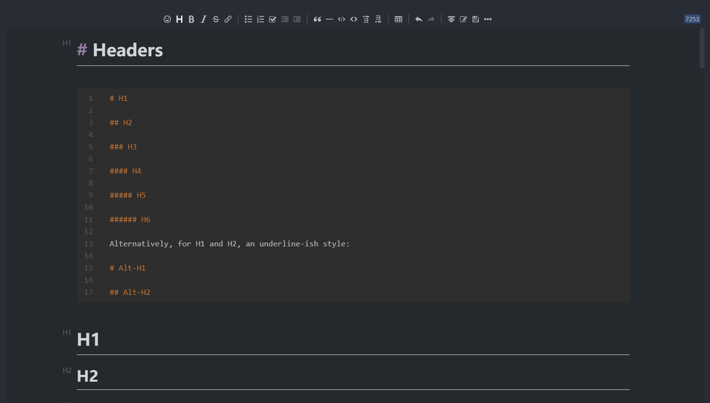

#### Support export to Zhihu

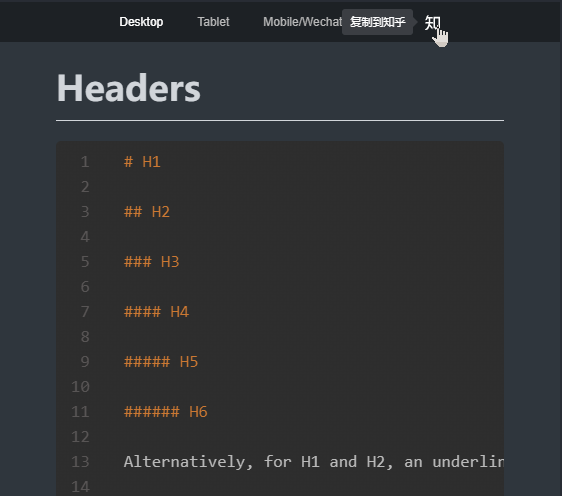

#### Custom preview toolbar actions

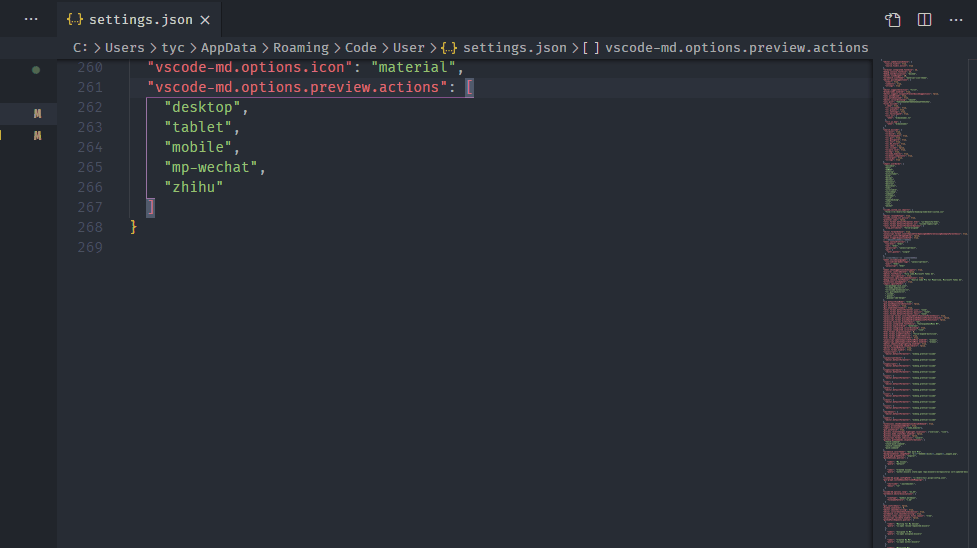

## v0.2.2

### ✨New Features

- Support mindmap:

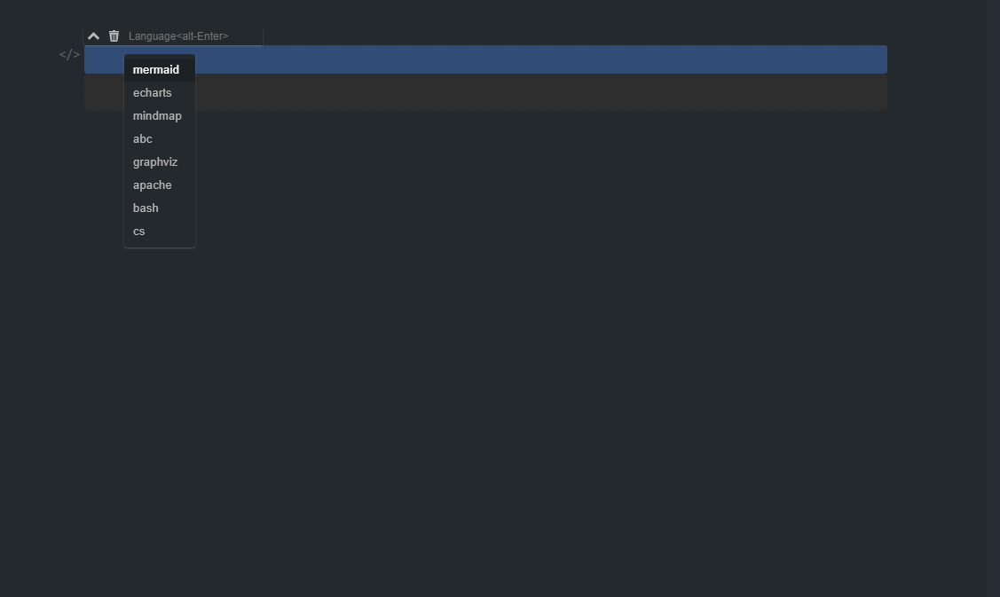

- Add row and column buttons to the table in 'wysiwyg' mode:

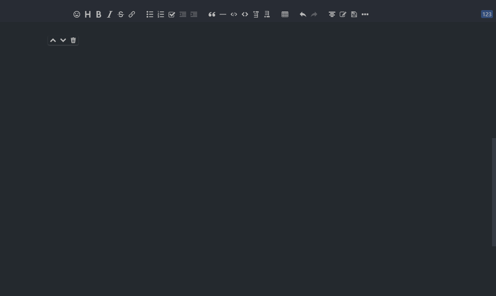

### 🐛 Bug Fixes

- Outline navigation failure #4
