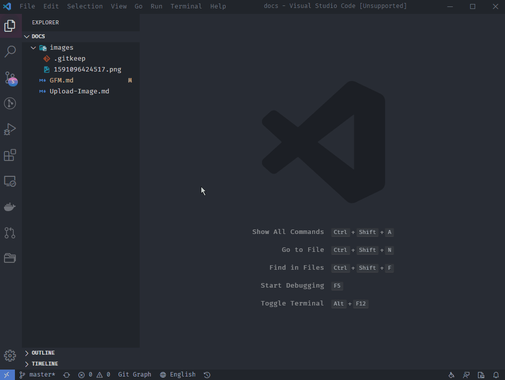

## 💡 Introduction

**Meet all needs of writing markdown on vscode**

## ✨ Features

- Support three editing modes: WYSIWYG, Instant Rendering and Split View

 
Demo
  

- Support outline, mathematical formulas, mind maps, charts, flowcharts, Gantt charts, timing charts, staffs, multimedia, voice reading, heading anchors, code highlighting and copying, graphviz rendering
- Multi-language support, built-in Chinese, English, Korean text localization
- Built-in security filtering, export, image lazy loading, task list, at, multi-platform preview, multi-theme switching, copy to WeChat function
- The toolbar contains 30+ items of operations.
- Emoji auto-complete.
- You can use drag and drop, clipboard and paste to store your images, and then store them locally or [upload to the server](./docs/Upload-Image.md).
- The markup HTML is automatically converted to Markdown.
- Support character counting.
- Multi-theme support.

## 🔧 Configurations

- `vscode-md.options.mode`: Choose default edit mode
  - `ir`: Instant render mode
  - `wysiwyg`: What-you-see-is-what-you-get mode
  - `sv`: Traditional split view mode
- `vscode-md.options.lang`: Localization, i18n
- `vscode-md.options.outline`: Show outline of markdown
- `vscode-md.options.counter.enable`: Whether to use counter
- `vscode-md.options.toolbarConfig.hide` : Whether to hide the toolbar
- `vscode-md.options.toolbarConfig.pin`: Whether to pin the toolbar
- `vscode-md.image.pathType`: The markdown image path type, relative/absolute/picgo
- `vscode-md.image.dirPath`: The directory used to store the pictures, it must be in workspace. The default is the path where Markdown is located
- `vscode-md.theme.global`: Global theme
- `vscode-md.theme.content`: Markdown content theme
- `vscode-md.theme.code`: Code theme, see [Chroma](https://xyproto.github.io/splash/docs/all.html) for more information
- `vscode-md.picgo.configPath`: The path to your PicGo configuration.

## 📚 Wiki

- [Image Upload](./docs/Upload-Image.md)
- [Shortcut key](https://hacpai.com/article/1582778815353#English)

## 📄 License

[MIT](https://opensource.org/licenses/MIT)

## ❤️ Thanks

[vditor](https://vditor.b3log.org/): An In-browser Markdown editor, support WYSIWYG, Instant Rendering (Typora-like) and Split View modes.

[picgo](https://picgo.github.io/PicGo-Doc/en/guide/#instruction): New Experience of Image Upload and Management
