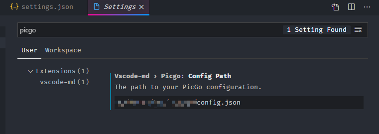

# Summary

In version 0.2.0, vscode-md support "upload image" function to upload images to a cloud image storage via [picgo-core](https://github.com/PicGo/PicGo-Core).

# Usage

1. Set `"vscode-md.image.pathType": "picgo"` .
2. Create config file for picgo:

```json
{
  "picBed": {
    "uploader": "smms",
    "smms": {
      "token": "token of smms"
    }
  }
}
```

This example uses smms as a place to store pictures. You need to log in  [sm.ms](https://sm.ms/home/) and get a token from the dashboard.

In addition, you can also use [Github](#Github), [Imgur](#Imgur), [Qiniu Cloud](#Qiniu-Cloud), [Tencent Cloud COS](#Tencent-Cloud-COS), [Upyun Cloud](#Upyun-Cloud), [Aliyun OSS](#Aliyun-OSS)

3. Set `vscode-md.picgo.configPath`:




4. Reopen your markdown file

# More

## Github

```json
{
  "picBed": {
    "uploader": "github",
    "github": {
        "repo": "",                                 // user/repo
        "token": "",                                // github token
        "path": "",                                 // storage path
        "customUrl": "", 		            // customized domain
        "branch": ""                                // branch, master by default   
    }
  }
}
```

For more information -> 📖 https://picgo.github.io/PicGo-Doc/en/guide/config.html#github-img

## Imgur

```json
{
  "picBed": {
    "uploader": "imgur",
    "imgur": {
      "clientId": "",                             // your clientId
      "proxy": ""                                 // proxy address, only http supported                 
    }
  }
}
```

For more information -> 📖 https://picgo.github.io/PicGo-Doc/en/guide/config.html#imgur-img

## Qiniu Cloud

```json
{
  "picBed": {
    "uploader": "qiniu",
    "qiniu": {
      "accessKey": "",
      "secretKey": "",
      "bucket": "",                               // storage bucket
      "url": "",                                  // customized domain
      "area": "z0" | "z1" | "z2" | "na0" | "as0", // storage area
      "options": "",                              // URL suffix
      "path": ""                                  // storage path
    }
  }
}
```

For more information -> 📖 https://picgo.github.io/PicGo-Doc/en/guide/config.html#qiuniu-img

## Tencent Cloud COS

For more information -> 📖 https://picgo.github.io/PicGo-Doc/en/guide/config.html#tencent-cloud-cos

## Upyun Cloud

For more information -> 📖 https://picgo.github.io/PicGo-Doc/en/guide/config.html#upyun-cloud

## Aliyun OSS

For more information -> 📖 https://picgo.github.io/PicGo-Doc/en/guide/config.html#aliyun-oss
